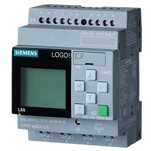

# Playing with the LOGO!8.3

- [Intro](#intro)
- [Hardware Analysis](#hardware-analysis)
- [Extracting and Analyzing the Firmware](#extracting--analyzing-the-firmware)
- [Assembly Debugging with Code Composer Studio](#assembly-debugging-with-code-composer-studio)
- [TLS Communication and Optiga Secure Element](#tls-communication-and-optiga-secure-element)
- [Generate an Arbitrary Device Certificate](#using-the-logo-product-ca-to-generate-an-arbitrary-device-certificate-with-a-known-private-key)
- [Password Challenge Response With CRC32](#password-challenge-response-with-crc32)
  - [Using the Internal Web Server and a Browser](#using-the-internal-web-server-and-a-browser)
  - [Using LOGO!Soft Comfort Software](#using-logosoft-comfort-software)
  - [Emulating a LOGO! Device Login Procedure](#emulating-a-logo-device-login-procedure)
- [Attack Scenario](#attack-scenario)
- [Conclusion](#conclusion)
- [Responsible Disclosure](#responsible-disclosure)
- [Fun Fact](#fun-fact)

## Intro

In this repository we are going to play around with a modern Siemens Programmable Logic Controller (PLC): the [LOGO! 8.3](https://www.siemens.com/global/en/products/automation/systems/industrial/plc/logo.html).



Our target is a LOGO! 8.3 12/24 RCE (`6ED1052-1MD08-0BA1`) with FW version `1.83.01`. Use cases are pump control, lightning, surveillance, industrial applications, etc.

It can be configured locally or via the Siemens `LOGO!Soft Comfort` (LSC) software or web-based (it has an internal web server). For remote configuration, an Ethernet port is available; all network communication is secured with TLS per default.

## Hardware Analysis

After opening the device, three main PCBs can be found:
* Relays and power supply PCB
* Display PCB
* Compute PCB / microcontroller (MCU)

Here is a picture of the compute PCB:


A TI microcontroller is implemented with the (unknown) marking `SC4C1294NCPDT`. This marking is very similar to the marking `TM4C1294NCPDT`, an ARM Cortex-M4 MCU belonging to the [TM4C129x family](https://www.ti.com/de-de/microcontrollers-mcus-processors/arm-based-microcontrollers/arm-cortex-m4-mcus/overview.html). The marking was probably changed for Siemens but this should be the same device (maybe there are some slight differences?).

A non obvious component, which I found later, is a Secure Element (`Sec. IC` on the picture) from Infineon called [optiga trust](https://www.infineon.com/cms/de/product/security-smart-card-solutions/optiga-embedded-security-solutions/optiga-trust/) in a very tiny package. It is connected via I2C to the MCU and is used for cryptographic operations and key storage. Communication between MCU and Secure Element is encrypted based on some pre-shared secrets. More information about the I2C protocol can be found [here](https://github.com/Infineon/optiga-trust-m/blob/develop/documents/Infineon_I2C_Protocol_v2.03.pdf).

JTAG pins are available on some test points on the PCB (but JTAG is disabled permanently): 


Any idea how to re-open JTAG? :-D

## Extracting & Analyzing the Firmware

What a coincidence, I already successfully bypassed the read-back / JTAG protection on the `TM4C129x` family (see [here](https://github.com/veganmosfet/EMFI-TI-TM4C12x)). Let's connect a JLINK JTAG probe and try it for the LOGO! TI MCU.

I had one problem at the beginning: after a successful EM-FI it is normally possible to reconnect the JLINK probe, assuming no reset has been performed in between. For the LOGO! this did not work, JTAG was only available once (any subsequent attempt was blocked), so I had to write a [JLINK script](https://github.com/veganmosfet/LOGO/blob/main/scripts/logo.JLinkScript) to read-back the whole Flash content directly after the first successful connection.

Here is a picture of the setup:


By having a look at the binary, one can notice that there is a random-looking array almost at the end of the Flash memory at address `0xF4000`:


This array contains the pre-shared secret used for secured communication with the Secure Element and it is different for each LOGO! device. This means that the MCU and the Secure Element are **paired**.

For further analysis **Ghidra** is our friend. Loading the binary is trivial, knowing the generic architecture `ARM Cortex Little Endian` and the execution address `0x0` (the device uses execution-in-place).

Let's find the SHA2 function in the binary -- I will explain later why. To do that, we search for the SHA2 constants (for example the `K` array) and find the function(s) using this array. The first word of the `K` array is `0x428a2f98`:


I already added some labels for the interesting functions: for example the basic SHA2 cryptographic operation is located at address `0x00089d9c`. Note that this function has two pointers as arguments: input and output arrays in `R1` resp. `R0`:


We will use this information later.

## Assembly Debugging with Code Composer Studio

We now switch to a dynamic analysis with a debugger. To do that, we create an empty project in TI Code Composer Studio using the `TM4C1294NCPDT` device with the JLINK debugger set:


We connect JTAG to the JLINK probe and launch a debug session. Now it is possible to debug the device at assembly level, setting breakpoints, reading and writing SRAM memory, registers, etc. We have full control -- but only assembly :confused:


For example, we can set a breakpoint at the beginning of the SHA2 function (using the address we found with Ghidra previously) and read / write the buffers located in internal SRAM starting at address `0x20000000`.

## TLS Communication and Optiga Secure Element

After having installed the `LOGO!Soft Comfort` (LSC) software we can connect our LOGO! device and record some traffic. TLS is used on port 8443:


We assume that the *Secure Element* is used for key storage and asymmetric cryptography whereas the symmetric operations are done in the MCU (i.e., packet encryption and integrity protection). 

Let's have a look at the certificates provided by the device fresh out-of-the-box. Two certificates are provided:

* A device certificate:
```
Certificate:
    Data:
        Version: 3 (0x2)
        Serial Number: 41150193061506532 (0x9231e1efdeade4)
        Signature Algorithm: sha256WithRSAEncryption
        Issuer: CN = LOGO Product CA V1.0, OU = Copyright (C) Siemens AG 2020 All Rights Reserved, O = Siemens, C = DE
        Validity
            Not Before: Mar  1 00:00:00 2020 GMT
            Not After : Mar  1 00:00:00 2021 GMT
        Subject: CN = 192.168.0.5, O = SEWC, C = CN
        Subject Public Key Info:
            Public Key Algorithm: id-ecPublicKey
                Public-Key: (256 bit)
                pub:
                    04:a8:bd:f3:02:fc:bb:57:03:9b:ff:c8:0f:ab:92:
                    13:f8:69:58:b1:fe:eb:72:05:2f:81:9d:2f:80:20:
                    93:ea:1a:b0:fc:7e:7d:cd:9e:4f:65:59:7e:55:0d:
                    36:e0:f5:be:3c:e3:63:73:cf:cd:e9:43:5a:2d:ee:
                    2e:9b:d0:78:7e
                ASN1 OID: prime256v1
                NIST CURVE: P-256
        X509v3 extensions:
            X509v3 Key Usage: critical
                Digital Signature, Key Encipherment, Key Agreement
            Netscape Cert Type:
                SSL Server, Object Signing
            X509v3 Basic Constraints:
                CA:FALSE
            X509v3 Subject Alternative Name:
                IP Address:192.168.0.5
    Signature Algorithm: sha256WithRSAEncryption
         20:58:8c:68:62:61:68:d0:4b:fe:76:5e:3f:a4:31:fa:b6:81:
         a8:06:01:f2:28:1c:6a:df:d4:c1:4d:33:1f:8b:2b:70:13:6b:
         13:d8:e7:fa:ad:ca:f9:87:1d:78:f6:3b:bc:9f:b6:cb:b6:7f:
         5e:03:1a:6b:16:3f:c6:f3:e6:06:10:e3:b0:73:33:b1:7e:9b:
         8e:25:c5:6f:e2:5a:62:88:4a:ba:34:90:04:59:ae:bb:8d:02:
         0c:bb:53:83:0d:85:b3:c5:96:e1:ca:78:f9:e0:ac:97:b8:bb:
         32:1d:79:b7:6f:d4:1c:65:93:e0:04:f0:ec:5b:a8:fe:81:d3:
         0e:df:43:38:dc:a0:07:ca:bf:ff:d7:6d:2d:8b:6a:78:4e:1f:
         c3:e6:0b:56:a2:d6:db:29:ad:07:db:db:2b:d8:35:be:a3:e6:
         84:15:0a:04:b5:78:44:7c:86:ec:43:37:75:77:93:fa:73:3d:
         c5:41:eb:d0:65:59:27:cc:fd:d3:06:3b:ac:06:21:ab:a3:39:
         65:12:78:50:cf:7b:99:34:1c:bd:de:3d:a9:54:52:75:0a:8b:
         41:b5:24:86:56:4c:9a:a0:45:4d:4c:71:2e:96:5f:16:d9:3a:
         e1:88:4f:64:73:01:27:a0:bc:00:44:68:33:da:18:38:2f:49:
         a9:29:4a:39
```
* ... and a CA certificate:
```
Certificate:
    Data:
        Version: 3 (0x2)
        Serial Number:
            1f:06:4e:c6:25:07:45:f8:b0:c0:94:59:e2:aa:d4:f1:17:00:69:34
        Signature Algorithm: ecdsa-with-SHA256
        Issuer: CN = LOGO Root CA V1.0, OU = Copyright (C) Siemens AG 2020 All Rights Reserved, O = Siemens, C = DE
        Validity
            Not Before: Jun  4 07:45:02 2020 GMT
            Not After : Jun 22 07:45:02 2070 GMT
        Subject: CN = LOGO Product CA V1.0, OU = Copyright (C) Siemens AG 2020 All Rights Reserved, O = Siemens, C = DE
        Subject Public Key Info:
            Public Key Algorithm: rsaEncryption
                RSA Public-Key: (2048 bit)
                Modulus:
                    00:a1:b1:8b:ee:66:de:a7:7f:0f:39:f1:5a:e2:12:
                    c4:46:48:ea:ca:96:74:03:97:65:a8:2b:f3:95:ee:
                    14:a1:08:29:a3:97:d0:ac:3f:a3:e3:5f:f7:5b:6d:
                    f2:4e:24:23:3a:19:34:58:5f:cb:0c:76:f2:ad:ce:
                    8a:1a:87:84:af:e3:e7:cc:c7:be:62:ce:97:38:d2:
                    c1:b6:73:54:74:b9:ff:20:ba:34:59:43:9a:0a:6b:
                    4b:59:ae:6c:e1:be:d6:19:10:d3:90:00:cb:1b:3f:
                    42:83:bb:f5:b1:fa:23:39:a3:13:c3:3c:2e:ec:76:
                    81:90:ac:b3:d9:3a:e3:e0:25:1b:03:b4:75:2f:23:
                    24:1f:7d:78:ac:e7:ad:d0:20:7c:8c:03:c4:1f:42:
                    b1:5d:e7:20:ca:75:21:7b:c4:78:52:48:c0:3b:ab:
                    e5:bf:62:69:67:ec:39:6a:54:48:e1:31:87:85:b2:
                    84:68:c1:c7:33:71:77:da:fe:c4:9c:81:17:6c:39:
                    f2:d0:c5:dd:a2:4d:0f:da:47:ed:0a:13:3d:22:5b:
                    ab:66:4f:46:29:13:21:e2:b8:36:83:e1:6f:bf:35:
                    88:4f:71:4c:0c:2c:82:13:cc:74:82:64:c4:1d:c2:
                    05:94:a0:a5:72:23:d4:34:3d:dd:8e:3d:9b:25:9a:
                    d6:1b
                Exponent: 65537 (0x10001)
        X509v3 extensions:
            X509v3 Subject Key Identifier:
                28:F1:91:AE:0B:5A:F8:39:9D:6B:02:DA:29:17:4C:54:78:AF:81:2C
            X509v3 Basic Constraints: critical
                CA:TRUE
            X509v3 Authority Key Identifier:
                keyid:F8:3B:D4:89:5D:AB:2C:0F:20:0D:EA:E8:0B:3D:36:6C:83:28:37:20

            X509v3 Key Usage: critical
                Digital Signature, Key Encipherment, Data Encipherment, Certificate Sign, CRL Sign
    Signature Algorithm: ecdsa-with-SHA256
         30:45:02:21:00:df:97:b2:02:98:da:83:e0:21:82:fe:b5:6f:
         b1:9c:f5:d7:cf:39:97:14:a4:1e:72:bf:73:69:13:05:f6:bf:
         ae:02:20:4b:ca:8b:c5:f1:26:4b:45:73:cc:49:5e:bc:32:91:
         1a:47:40:58:17:77:61:c4:2f:e6:a0:da:42:ff:e8:a7:74
```

Note, that the device time has not been initialized. This explains why the device certificate has a wrong validity period -- but this is accepted by the LSC software. If we update the device time, a new certificate is generated with a correct validity period:

```
Certificate:
    Data:
        Version: 3 (0x2)
        Serial Number: 41150193061506537 (0x9231e1efdeade9)
        Signature Algorithm: sha256WithRSAEncryption
        Issuer: CN = LOGO Product CA V1.0, OU = Copyright (C) Siemens AG 2020 All Rights Reserved, O = Siemens, C = DE
        Validity
            Not Before: Jun  1 00:00:00 2023 GMT
            Not After : Jun  1 00:00:00 2024 GMT
```

This means that the device certificate is generated **inside the device itself on-the-fly**. 

After long hours (and days) of debugging, I found out how it basically works:

1. MCU requests a key pair from the Secure Element, in order to build a new device certificate (elliptic curve cryptography is used).
2. Secure Element sends the public key back to the MCU, **the private key is not sent back and stays in the Secure Element**.
3. MCU generates a device certificate (w/o signature) with IP address as the Common Name, MAC address as the serial number, validity period based on the internal RTC and the public key obtained in the previous step.
4. MCU generates a hash (SHA2-256) of the new certificate.
5. MCU sends the certificate hash to the Secure Element with a signature request.
6. Secure Element signs the hash with the private key of the `LOGO Product CA V1.0` certificate.
7. Secure Element sends the signature back.
8. MCU builds the complete device certificate incl. signature.

A new certificate is generated every time a parameter changes (e.g., time, IP address). For each TLS session, the Secure Element is involved in the key establishment procedure (as it owns the device certificate related private key).

## Using the LOGO Product CA to Generate an Arbitrary Device Certificate With a Known Private Key

By modifying the public key in the MCU before the SHA2-256 hash of it was generated, we can spoof an arbitrary device certificate -- for which we **have the private key**. This is due to the fact that the MCU first requests a public key, creates the certificate, and only sends the certificate's hash to the Secure Element for the signature request.

These are the required steps to achieve this attack:

1. De-power the device and remove the compute PCB from the power-supply PCB. This is important in order to reset the RTC completely: the power-supply PCB implements a super-CAP in order to retain time.
2. Power the device. Connect the JLINK probe to the device and start a debugging session in Code Composer Studio. Reset the system (`run` > `reset` > `system reset`).
3. Start the MCU until Ethernet is up
4. Halt the MCU
5. Activate a breakpoint at address `0x00089d9c` (SHA2 operation)
6. Start the MCU
7. Start `LOGO!Soft Comfort` and establish a live connection with the device (`online` > `connect`).
8. The MCU shall halt at the breakpoint
9. Save `17` (`0x11`) words of internal SRAM memory at `0x2003f6c0` (SH2 buffer address) in a file called `pu.bin`. To do that, use the `save memory` operation of Code Composer Studio (`memory` tab) and use the binary format:


10. This array corresponds to the public key received from the security IC (note that the first byte `0x04` and the last 3 bytes `0xA3 0x41 0x30` are constant and not part of the raw public key, we need them only for alignment):


11. Generate a key pair with openssl:
```bash
$ openssl ecparam -name prime256v1 -genkey -noout -out prkey.pem
$ openssl ec -in prkey.pem -pubout -out pukey.pem
```
12. Convert the raw public key contained in `pukey.pem` to a binary file `pukey.bin`. Remove the first `26` bytes of metadata. This file shall be exactly `65` bytes long and begin with `0x04`.
13. In `pu.bin`, replace the `65` bytes at the beginning with the `65` bytes obtained in the previous step (i.e., our own public key).
14. Use the `load memory` function of Code Composer Studio to replace `17` memory words at `0x2003f6c0` with `pu.bin`. Use binary format!
15. Disable the breakpoint and run.
16. In Wireshark, get the device certificate. Check the public key. For this key we **own the private key** :boom:

## Password Challenge Response With CRC32

The LOGO! device uses password-based authentication. We will now reverse engineer the challenge response mechanism used during the login procedure.

### Using the Internal Web Server and a Browser

The LOGO! internal web server has to be activated (with TLS) via `LOGO!Soft Comfort`. We use the `SSLKEYLOGFILE` environmental variable on our PC to decrypt TLS traffic when using our browser.

The password challenge response mechanism is implemented in the `login.js` file provided by the device and can be obtained by sniffing the decrypted traffic in Wireshark. 

The following HTTP messages are used during login:

1. `POST` HTTP request from PC to LOGO!: `UAMCHAL:3,4,1,2,3,4` 
2. `200` HTTP response from LOGO! to PC: `700,ADD235A9AB070AEF8A3E522F5E1B91F1,3068672418`: this message contains the **challenge** `3068672418`
3. `POST` HTTP request from PC to LOGO!: `UAMLOGIN:Web User,3111008995,3068672422`: this message contains the **response** `3111008995`
4. `200` HTTP response from LOGO! to PC if login was successful

The computation of the response can be found in the `login.js` file:

```javascript
var sPasswordToken = this.m_oContext.m_sPassword + "+" + this.m_oContext.m_iKey2;
sPasswordToken = sPasswordToken.substr(0, 32);
var iPasswordToken = (MakeCRC32(String2UTF8(sPasswordToken)) ^ this.m_oContext.m_iKey2) >>> 0;
```

where:

`m_sPassword`: the password typed by the user

`m_iKey2`: the challenge sent by the LOGO! device

`iPasswordToken`: the response sent to the LOGO! device

A CRC32 function is used instead of a proper hash function, meaning that we can easily find collisions. However, the challenge response mechanism is encrypted with TLS.

### Using LOGO!Soft Comfort Software

First we patch the LSC software so that TLS communication can be decrypted. To do that, we patch the file called `start.lax` in the LSC installation directory. Download `jSSLKeyLog.jar` and adapt the file path as seen below:

```
#   LAX.NL.JAVA.OPTION.ADDITIONAL
#   -----------------------------
#   - Set library-path at starttime (Search-path for .dl'ls). 
#   - DirectDraw ausschalten
#   - DirectDraw ausschalten
#   - DirectDraw ausschalten
#   - Incrementellen GarbageCollector aktivieren

lax.nl.java.option.additional=-Djava.library.path=bin -Dsun.java2d.noddraw=true -XX:ThreadStackSize=4096 -javaagent:C:\\DATA\\LOGO\\LOGO\\JAVA\\jSSLKeyLog.jar==C:\\DATA\\LOGO\\LOGO\\JAVA\\jssl-key.log
```

Using Wireshark, we find that the login procedure uses a similar challenge-response mechanism. TLS is enforced.

### Emulating a LOGO! Device Login Procedure

With a simple web server we can emulate the login procedure of a LOGO! device, knowing that we can generate a valid certificate for which we own the private key. Our goal is to build a simple web server to get a valid TLS connection from LSC and record the password challenge-response procedure. A simple Python script and a certificate (incl. private key) can be found [here](./server/).

First the Python script is started, then LSC is started and a connection to the emulated device is initiated. LSC will accept the certificate presented and asks for the password:


As soon as a user enters the password, the response is logged:

```
Http Server Serving at port 8443
192.168.0.5 - - [22/Jun/2023 21:16:01] "GET /main.shtm HTTP/1.1" 200 -
192.168.0.5 - - [22/Jun/2023 21:16:07] "POST /Ajax HTTP/1.1" 200 -
b'UAMCHAL:3,4,2905034359,2406265054,2491523309,3205636679,LSC User'
>>> Send 700,0,0 to User
192.168.0.5 - - [22/Jun/2023 21:17:06] "POST /Ajax HTTP/1.1" 200 -
b'UAMLOGIN:LSC User,1733197890,165182467'
```

In this log, a valid challenge-response pair can be found:
* Challenge: `0` (set by the script)
* Response: `1733197890` (first integer number after user name)

With a known password (in our case it is `xxxxxxxx`) we can compute the response offline:

`CRC32(xxxxxxxx+0) = 0x674E8042 = 1733197890` ✔️

## Attack Scenario

Assuming an attacker has access to the network to which the LOGO! is connected. First, he/she generates a valid LOGO! certificate and connects a computer to the same network with our custom [TLS server](./server/) to spoof the login procedure. Next, the attacker runs an ARP poisoning attack to MITM the victim's traffic. As soon as a valid user tries to connect to the targeted LOGO! with LSC, the connection will be re-routed to the attacker computer. 

Since a valid certificate chain can be presented, the login procedure is initiated. The attacker can then record a valid challenge-response pair.

Based on this challenge-response pair, the attacker uses two properties of the CRC32 algorithm to find a valid password:

1. CRC32 can be backward computed i.e. bytes can be *removed* from the end. For example if we know `CRC32('xxxxxxxx+0')` we can compute `CRC32('xxxxxxxx')` w/o knowing `xxxxxxxx`. A [very simple C code](./scripts/CRC.cpp) is provided to remove `+0` from a given response. Let's run this script with our example:

```bash
$ Enter the PW Token of user as int (from pwcrc file, first number after user): 1733197890
CRC of PW+0 = 0x674E8042
CRC of PW only= 0xA69254C9
Now as signed integer (to copy in go): -1500359479
END
```

2. CRC32 is not a proper hash function and collisions can be found easily. [This golang script](https://github.com/fyxme/crc-32-hash-collider) can be used to find collisions. Using the result of the previous step, we can find a collision for our password and try it for the targeted LOGO! device. Note, that it can be different than the original password but will be accepted by the LOGO! device due to the CRC32 based challenge-response procedure.

In our example, we copy the signed integer value from above into the Golang script:

`const target = -1500359479 & 0xffffffff`

Then, we run the script with `$ go run .\crc-32-collide.go`

The first collision found is:  `0bw8N)`

`CRC32('0bw8N)') = 0xa69254c9`

This password is accepted by the LOGO! device 🗼

## Conclusion

In the first part of this article, a hardware reverse engineering work on the LOGO!8.3 was described. Using Electromagnetic Fault Injection (EM-FI), JTAG was re-opened and the firmware of the microcontroller was extracted. Using binary static analysis with Ghidra **and** dynamic analysis with a debugger, the device certificate creation procedure was reverse engineered. Abusing a vulnerability in the certificate handling procedure (i.e., the fact that the public key generated by the Secure Element can be modified before the signing request is sent), the public key could be replaced with a key for which the private key is known. Finally, a valid certificate signed by the LOGO! Product CA was then extracted.

In the second part, we analyzed the password-based login procedure of the LOGO! device via the internal web-server and the LSC software. Since it uses CRC32 instead of a proper hash function, an attacker could find a valid password by recording one challenge-response pair. This could be done by using the fake device certificate and spoofing a legitimate LOGO! device with a simple custom web-server running in the same LAN.

## Responsible Disclosure

* 2022-08-24: Disclosure to Siemens Product CERT
* 2023-12-12: Clearance to publish. [Advisory](https://cert-portal.siemens.com/productcert/html/ssa-844582.html) has been released.
## Fun Fact

I bricked my first LOGO!8.3 device (the MCU) after having extracted the firmware. At that time I was not aware of the pairing mechanism and I loaded the same firmware into a second LOGO! device. I was surprised that TLS was not working at all 😠. Then, I literally cut the optiga Secure Element from the first device PCB and soldered the pins (I2C + power) to the functioning second device. Magic: it worked! :-D


